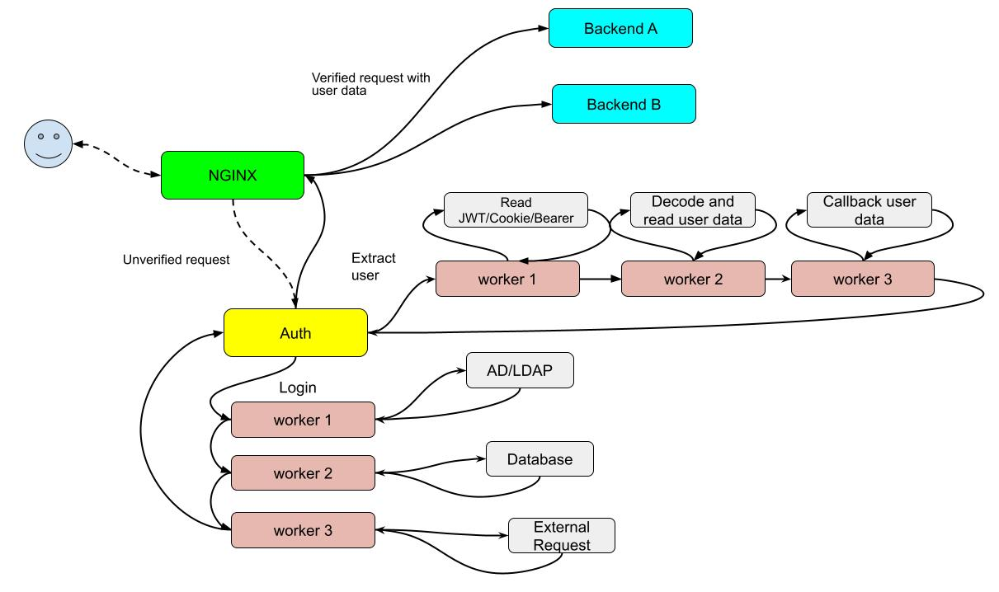

# reneos.auth
Applications for authorization and user authentication, optimized for microservices architecture.

How to use:

npm i @reneos/auth

see ./examples/

On russian https://habr.com/ru/post/591319/

Request processing queue configurations define the stages of request processing. In the "workers" folder, each script is a link in the processing chain. The result returned from each "module" is passed to the next "module". If the "module" did not return a result (or returned null), processing ends.
You can make "module" in any order in a "chain". If you have not found the required processing option - write your "module".




# Worker Module Guidelines

This document provides instructions for creating modules to be used within the worker pipeline system. Follow these guidelines to ensure compatibility and functionality.

---

## Module Requirements

### Exported Function

Each module must export a default function that serves as a handler in the processing chain. The function should have the following structure:

```javascript
export default async function (options, input, req, res) {
    console.log(options, input, req)
    const output = {}
    return output; // Return the processed result
}
```

### Function Arguments

The exported function must handle the following arguments:

1. **`options`**: An object of settings defined in the configuration.
2. **`input`**: The result from the previous handler in the chain (or an empty object for the first handler).
3. **`req`**: The HTTP request object.
4. **`res`**: The HTTP response object.

### Function Output

The function must return a processed result, either synchronously or asynchronously. Returning `undefined` or `null` will terminate the chain with an error.

### Error Handling

Errors occurring within the module should be thrown using `throw`. These will be captured and emitted through `_emitter.emit('errorchain')`.

## Module Integration

### Module Naming

The name specified in the configuration must match the name of the exported module.

### Module Files

Modules must be passed through the `mods` object when calling `Worker.Start`.

---

## Configuration Example

```json
{
  "configs": [
    {
      "routes": [
        {
          "path": "/example",
          "workers": [
            { "name": "Logger", "options": { "level": "info" } },
            { "name": "Processor", "options": { "type": "json" } }
          ]
        }
      ]
    }
  ]
}
```

### Route Processing (`/example`)

1. The `Logger` module is called with `{ "level": "info" }` as `options`.
2. Its result is passed to the `Processor` module with `{ "type": "json" }` as `options`.

---

## Events

### `errorchain`

Emitted when an error occurs in a module or during route processing. Use this for debugging and monitoring.

### `ready`

Emitted after all routes are successfully registered.

### `endchain`

Emitted when an module return null 

---

## Example Configuration for Testing

To test modules in isolation, use a simple configuration structure to simulate inputs and verify expected behavior.

